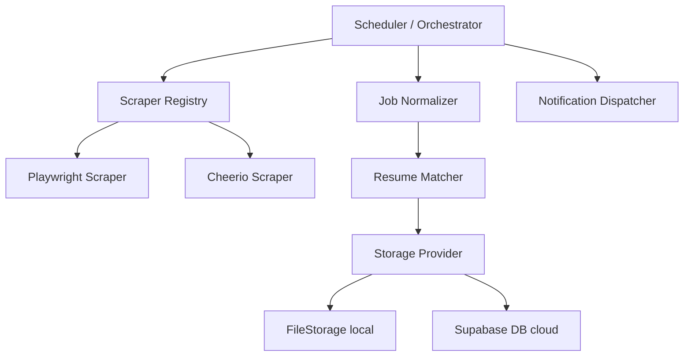

# Job Monitor Platform

An enterprise-grade, autonomous career copilot and job monitoring system featuring intelligent resume matching, skill gap analytics, automated apply workflows, recruiter CRM tracking, and multi-channel notification pipelines.

[](https://github.com/job-monitor/platform/actions)
[](./LICENSE)

---

## Project Overview

Modern job hunting is fragmented and highly manual. The **Job Monitor Platform** bridges this gap by acting as a personal, autonomous career agent. Instead of checking job boards, the system actively crawls them (supporting Greenhouse, Lever, and Workday portals). It normalizes postings, calculates an algorithmic fit score using tokenization and TF-IDF cosine-similarity NLP, detects technical skill gaps, drafts learning syllabi, tracks outreach CRM contacts, and leverages a background queue to auto-apply to target openings.

---

## Features

- **Auto Apply Engine**: Automated form filler for Lever and Greenhouse portals with queue scheduling, payload validation, and retry handles.
- **Resume Version Manager**: Manage multiple resumes (Backend, Frontend, FullStack, AI, ML) and auto-recommend matching profiles.
- **LLM Resume Tailoring & Cover Letters**: Analyze technical skill gaps to optimize summaries, bullets, and export PDF/Markdown cover letters.
- **Recruiter CRM**: Log recruiter conversations, follow-up alerts, LinkedIn connections import, and touchpoints history.
- **Calendar Integrations**: Generate standard RFC-5545 compliant `.ics` calendar invitation files for interviews and calls.
- **Opportunity Rankings & Portfolio Recommender**: Rank jobs by weighted opportunity fit scores and suggest matching GitHub repos.
- **Autonomous Scraper Queue**: Priority-based task runner scraping Lever, Greenhouse, Workday, and other career boards.
- **Express REST API & Analytics**: Rich metrics exporter dashboard, feature flags switcher, and exports center.

---

## Technology Stack

- **Core**: TypeScript, Node.js (ESM), Express 5
- **Frontend**: React 19, Vite v8, TailwindCSS v4, TanStack React Query v5, Recharts
- **Scraping**: Playwright, Cheerio, HttpClient
- **Database**: Supabase / Postgres (with FileStorage local mode flat-file fallback)
- **Email Alerts**: Resend API
- **Testing**: Jest, ts-jest, Playwright (E2E)

---

## Architecture Overview

The system runs on a decoupled React SPA frontend and a TypeScript Node.js backend. To prevent scraping conflicts between duplicate instances in production, it utilizes Postgres distributed advisory locks.

For more details, view the [Architecture Guide](file:///c:/Users/varun/Downloads/Job%20Monitor/docs/ARCHITECTURE.md).



---

## Installation & Setup

### Prerequisites
- Node.js >= 20.0.0
- npm >= 9.0.0

### Steps
1. Clone and install dependencies:
   ```bash
   git clone https://github.com/your-username/job-monitor.git
   cd job-monitor
   npm install
   ```
2. Configure environment variables in `.env` (see table below).
3. Build the project:
   ```bash
   npm run build
   ```

---

## Local Development

Run the API server, TypeScript compiler watcher, and frontend in parallel:
```bash
npm run dev:start
```

Run test suite sequentially (due to shared FileStorage assets during local testing runs):
```bash
npm test -- --runInBand
```

### Local Development Authentication

When running in local offline mode (`IS_LOCAL=true` / absence of Supabase environment secrets), the application uses mock credentials for role check testing:

```bash
# Local Development Credentials
LOCAL_ADMIN_EMAIL=admin@jobmonitor.com
LOCAL_ADMIN_PASSWORD=admin123
LOCAL_USER_EMAIL=user@jobmonitor.com
LOCAL_USER_PASSWORD=user123
LOCAL_VIEWER_EMAIL=viewer@jobmonitor.com
LOCAL_VIEWER_PASSWORD=viewer123
```

- **Admin:** admin@jobmonitor.com / admin123
- **User:** user@jobmonitor.com / user123  
- **Viewer:** viewer@jobmonitor.com / viewer123

---

## Environment Variables

| Variable | Description | Default | Required |
| -------- | ----------- | ------- | -------- |
| `PORT` | API Server listening port | `3000` | No |
| `NODE_ENV` | Mode (`development` or `production`) | `development` | No |
| `SUPABASE_URL` | Supabase Cloud Database URL | - | Yes (Prod) |
| `SUPABASE_SERVICE_KEY` | Supabase Service API Key | - | Yes (Prod) |
| `RESEND_API_KEY` | Resend SMTP API Key | - | Yes (Prod) |
| `NOTIFICATION_EMAIL_SENDER` | Email address sending digests | `alerts@yourdomain.com` | Yes (Prod) |
| `NOTIFICATION_EMAIL_RECIPIENT`| Candidate email receiving digests| - | Yes (Prod) |

---

## Docker Deployment

A `Dockerfile` and `docker-compose.yml` are provided in the repository root.

1. **Build Container**:
   ```bash
   docker build -t job-monitor:latest .
   ```
2. **Run Container**:
   ```bash
   docker run -d \
     --name job-monitor \
     -p 3000:3000 \
     --env-file .env \
     job-monitor:latest
   ```

*Note: Headless environments must verify that Playwright Chromium dependencies are installed: `npx playwright install --with-deps chromium`.*

---

## Documentation Index

Comprehensive reference guides are located under the `/docs` directory:

1. **[Product Requirements (PRD)](file:///c:/Users/varun/Downloads/Job%20Monitor/docs/PRD.md)**: Details vision, personas, requirements, success metrics, and scope.
2. **[Architecture Guide](file:///c:/Users/varun/Downloads/Job%20Monitor/docs/ARCHITECTURE.md)**: Diagrams system components, matching heuristics, and database workflows.
3. **[Engineering Rules](file:///c:/Users/varun/Downloads/Job%20Monitor/docs/RULES.md)**: Coding standards, conventions, logging schemas, security rules, and code review checklists.
4. **[Development Phases](file:///c:/Users/varun/Downloads/Job%20Monitor/docs/PHASES.md)**: History of implementation stages from MVP to current automation upgrades.
5. **[UI Design System](file:///c:/Users/varun/Downloads/Job%20Monitor/docs/DESIGN.md)**: Dark theme variables, glassmorphic layout components, and typography.
6. **[Project Memory](file:///c:/Users/varun/Downloads/Job%20Monitor/docs/MEMORY.md)**: Active project state ledger, recent fixes, schema summaries, and current technical debt.
7. **[Directory Structure](file:///c:/Users/varun/Downloads/Job%20Monitor/docs/FOLDER_STRUCTURE.md)**: Directory maps and file cleanup rules.
8. **[REST API Reference](file:///c:/Users/varun/Downloads/Job%20Monitor/docs/API.md)**: Endpoints query models, JSON payload examples, and auth rules.
9. **[Database Schema](file:///c:/Users/varun/Downloads/Job%20Monitor/docs/DATABASE.md)**: Table definitions, RLS policies, trigger rules, and migration indices.
10. **[Feature Inventory](file:///c:/Users/varun/Downloads/Job%20Monitor/docs/FEATURES.md)**: List of all capabilities, code locations, and planned updates.
11. **[Technology Stack](file:///c:/Users/varun/Downloads/Job%20Monitor/docs/TECH_STACK.md)**: Framework dependencies and packages usage purposes.
12. **[Changelog](file:///c:/Users/varun/Downloads/Job%20Monitor/docs/CHANGELOG.md)**: Details of changes added in v1.0.0 through v5.0.0 releases.

---

## CLI Usage

Command-line utilities are exposed via `dist/cli/admin.js`:

```bash
# Force runs the scraper orchestrator
npm run monitor

# Show system health metrics
npm run health

# Show scrape run statistics
npm run stats
```

---

## License

This project is licensed under the [MIT License](./LICENSE).
