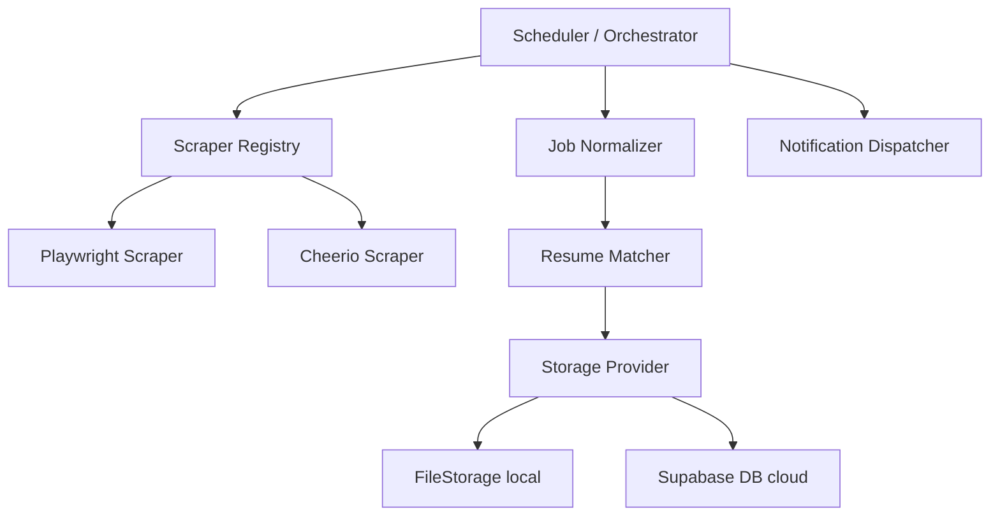

# Job Monitor Platform

An enterprise-grade, autonomous career copilot and job monitoring system featuring intelligent resume matching, skill gap analytics, and multi-channel notification pipelines.

[](https://github.com/job-monitor/platform/actions)
[](./LICENSE)

---

## Features

- **Auto Apply Engine**: Automated form filler for Lever and Greenhouse portals with queue scheduling and retry handles.
- **Resume Version Manager**: Manage multiple resumes (Backend, Frontend, FullStack, AI, ML, Data, BusinessAnalyst) and auto-recommend matching profiles.
- **LLM Resume Tailoring & Cover Letters**: Analyze technical skill gaps to optimize summaries, bullets, and export PDF/Markdown cover letters.
- **Recruiter CRM**: Log recruiter conversations, follow-up alerts, and touchpoints history.
- **Calendar Integrations**: Generate standard RFC-5545 compliant `.ics` calendar invitation files for interviews and calls.
- **Opportunity Rankings & Portfolio Recommender**: Rank jobs by weighted opportunity fit scores and suggest matching GitHub repos.
- **Autonomous Scraper Queue**: Priority-based task runner scraping Lever, Greenhouse, Workday, and other career boards.
- **Express REST API & Analytics**: Rich metrics exporter dashboard, feature flags switcher, and exports center.

---

## Tech Stack

- **Core**: TypeScript, Node.js (ESM), Express 5
- **Scraping**: Playwright, Cheerio, HttpClient
- **Database**: Supabase / Postgres (with FileStorage local mode fallback)
- **Email**: Resend API
- **Testing**: Jest, ts-jest, Playwright (E2E)

---

## Architecture Overview



---

## Installation & Setup

### Prerequisites
- Node.js >= 18.0.0
- npm >= 9.0.0

### Steps
1. Clone and install dependencies:
   ```bash
   git clone https://github.com/your-username/job-monitor.git
   cd job-monitor
   npm install
   ```
2. Configure environment variables in `.env` (see table below).
3. Build the project:
   ```bash
   npm run build
   ```

---

## Local Development

Run the API server, TypeScript watcher, and frontend in parallel:
```bash
npm run dev:start
```

Run test suite sequentially:
```bash
npm test -- --runInBand
```

### Local Development Authentication

When running in local mode (`IS_LOCAL=true`), the application uses environment variables for authentication. Configure these in your `.env` file:

```bash
# Local Development Credentials
LOCAL_ADMIN_EMAIL=admin@jobmonitor.com
LOCAL_ADMIN_PASSWORD=admin123
LOCAL_USER_EMAIL=user@jobmonitor.com
LOCAL_USER_PASSWORD=user123
LOCAL_VIEWER_EMAIL=viewer@jobmonitor.com
LOCAL_VIEWER_PASSWORD=viewer123
```

**Default credentials for local development:**
- **Admin:** admin@jobmonitor.com / admin123
- **User:** user@jobmonitor.com / user123  
- **Viewer:** viewer@jobmonitor.com / viewer123

**IMPORTANT:** These credentials are for local development only. Never use them in production. In production mode, the application uses Supabase authentication.

---

## Environment Variables

| Variable | Description | Default | Required |
| -------- | ----------- | ------- | -------- |
| `PORT` | API Server listening port | `3000` | No |
| `NODE_ENV` | Mode (`development` or `production`) | `development` | No |
| `SUPABASE_URL` | Supabase Cloud Database URL | - | Yes (Prod) |
| `SUPABASE_SERVICE_KEY` | Supabase Service API Key | - | Yes (Prod) |
| `RESEND_API_KEY` | Resend SMTP API Key | - | Yes (Prod) |

---

## CLI Usage

Command-line utilities are exposed via `dist/cli/admin.js`:

```bash
# Force runs the scraper orchestrator
npm run monitor

# Show system health metrics
npm run health

# Show scrape run statistics
npm run stats
```

---

## API Documentation

Key endpoints:
- `POST /api/auth/login`: Authenticate local session.
- `GET /api/dashboard`: Retrieve stats, jobs list, and notifications.
- `GET /api/applications/queue`: List applications queued for submission.
- `GET /api/opportunities`: List all matching jobs sorted by Opportunity Score.
- `GET /api/recruiters`: Fetch contacts registered in CRM database.
- `GET /api/calendar`: Fetch scheduled interview events.
- `GET /api/calendar/:id/ics`: Download standard ICS file for an event.
- `POST /api/export`: Export database telemetry and tables to PDF/CSV/Markdown/JSON.
- `GET /health`: Prometheus/Status telemetry.

---

## License

This project is licensed under the [MIT License](./LICENSE).
