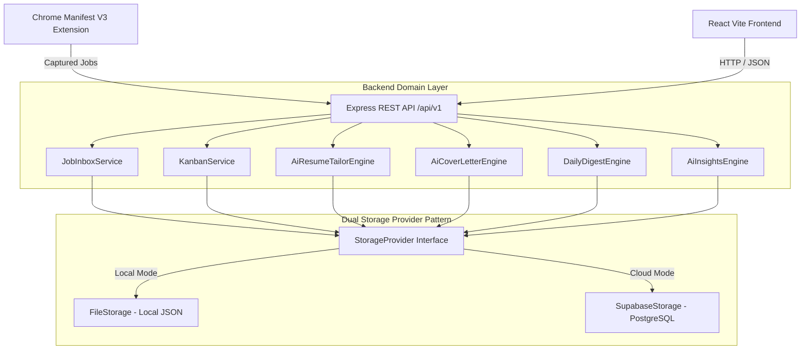

# 🚀 Job Search Tracker — AI Career Operating System (v2.0)

[](LICENSE)
[]()
[]()
[](https://www.typescriptlang.org/)
[](https://react.dev/)
[](https://nodejs.org/)
[](https://www.postgresql.org/)

**Job Search Tracker** is an open-source, full-stack **AI Career Operating System** engineered to streamline, organize, and automate every phase of the modern technology job search. Featuring a Manifest V3 Chrome Extension, a 3-tier Job Inbox queue, per-job AI Workspaces, zero-fabrication ATS resume tailoring, tone-tailored cover letter generation, multi-channel daily career digests, calendar `.ics` event sync, and empirical conversion analytics.

---

## 📑 Table of Contents
- [✨ Key Features](#-key-features)
- [🏗️ System Architecture](#️-system-architecture)
- [🧩 Chrome Extension (Manifest V3)](#-chrome-extension-manifest-v3)
- [🧠 Zero-Fabrication AI Workspaces](#-zero-fabrication-ai-workspaces)
- [🔒 Security & SSRF Defense](#-security--ssrf-defense)
- [🛠️ Technology Stack](#️-technology-stack)
- [🚀 Quick Start & Installation](#-quick-start--installation)
- [🐳 Docker Deployment](#-docker-deployment)
- [🧪 Testing & Quality Assurance](#-testing--quality-assurance)
- [❓ FAQ](#-faq)
- [📄 License](#-license)

---

## ✨ Key Features

- 🧩 **Manifest V3 Chrome Extension**: One-click job capture from LinkedIn, Greenhouse, Lever, Workday, Ashby, Wellfound, SmartRecruiters, Taleo, Indeed, and Glassdoor with offline queueing (`chrome.storage.local`).
- 📥 **Job Inbox Queue**: Intermediate staging queue separating raw web captures from active application cards.
- 📋 **11-Stage Kanban Tracker**: Visual drag-and-drop workflow tracking applications through 11 customizable lifecycle stages with fractional sorting algorithms.
- 🧠 **Zero-Fabrication AI Workspaces**: Keyword match density heatmaps, ATS bullet optimization suggestions, and DSA/system design interview topic extraction without experience hallucination.
- ✉️ **Tone-Tailored Cover Letter Generator**: Generates customized cover letter drafts matching specific company profiles with customizable tone and length constraints.
- 🔔 **Multi-Channel Daily Career Digest**: Scheduled digest dispatching notifications via Email, Slack Webhooks (with SSRF protection), and Telegram Bots.
- 📅 **Calendar `.ics` Sync**: One-click RFC-5545 calendar invite export for Google Calendar, Apple Calendar, and Outlook.
- 📊 **Empirical Conversion Analytics**: Real-time insights tracking application response rates, interview conversion percentages, and top-performing resume profiles.

---

## 🏗️ System Architecture



---

## 🛠️ Technology Stack

- **Frontend**: React 18, TypeScript, Vite, React Query, Lucide Icons, Vanilla CSS Design System
- **Backend**: Node.js, Express, TypeScript, REST APIs
- **Database / Persistence**: PostgreSQL (Supabase) & Local JSON File Storage
- **Browser Extension**: Chrome Extension Manifest V3 (Service Workers, Content Scripts)
- **DevOps & Testing**: Docker, Docker Compose, Jest, ESLint, GitHub Actions

---

## 🚀 Quick Start & Installation

### 1. Clone & Install Dependencies
```bash
git clone https://github.com/Varun2045/job-search-tracker.git
cd job-search-tracker
npm install
npm --prefix frontend install
```

### 2. Environment Configuration
Copy `.env.example` to `.env`:
```bash
PORT=3000
STORAGE_MODE=file
SUPABASE_URL=your_supabase_url
SUPABASE_KEY=your_supabase_anon_key
```

### 3. Run Locally
```bash
# Start backend REST API server
npm run dev

# Start frontend development client (in another terminal)
npm --prefix frontend run dev
```

---

## 🧪 Testing & Quality Assurance

```bash
# Run backend unit & integration tests
npm test

# Run TypeScript typecheck
npx tsc --noEmit

# Run ESLint validation
npm run lint
```

---

## ❓ FAQ

**Q: Does the AI generator invent candidate experience?**  
*A: No. All AI engines operate under strict zero-fabrication guardrails, extracting keywords and rephrasing existing candidate skills without inventing titles, dates, or false metrics.*

**Q: Can I run this locally without PostgreSQL?**  
*A: Yes! By setting `STORAGE_MODE=file` in your `.env` file, the application operates entirely using local JSON files.*

---

## 📄 License
Distributed under the MIT License. See [LICENSE](LICENSE) for details.
