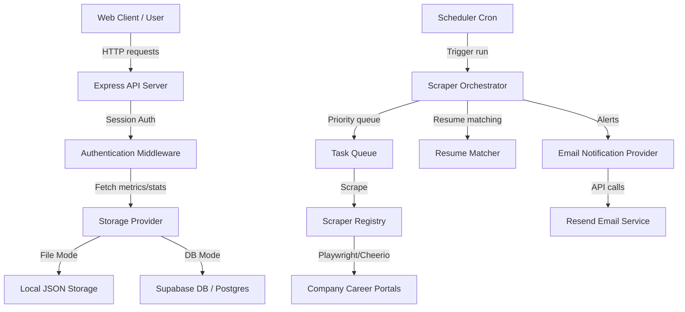
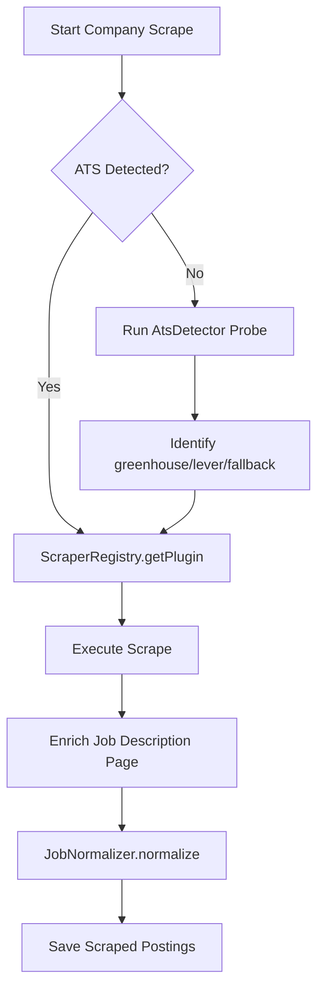
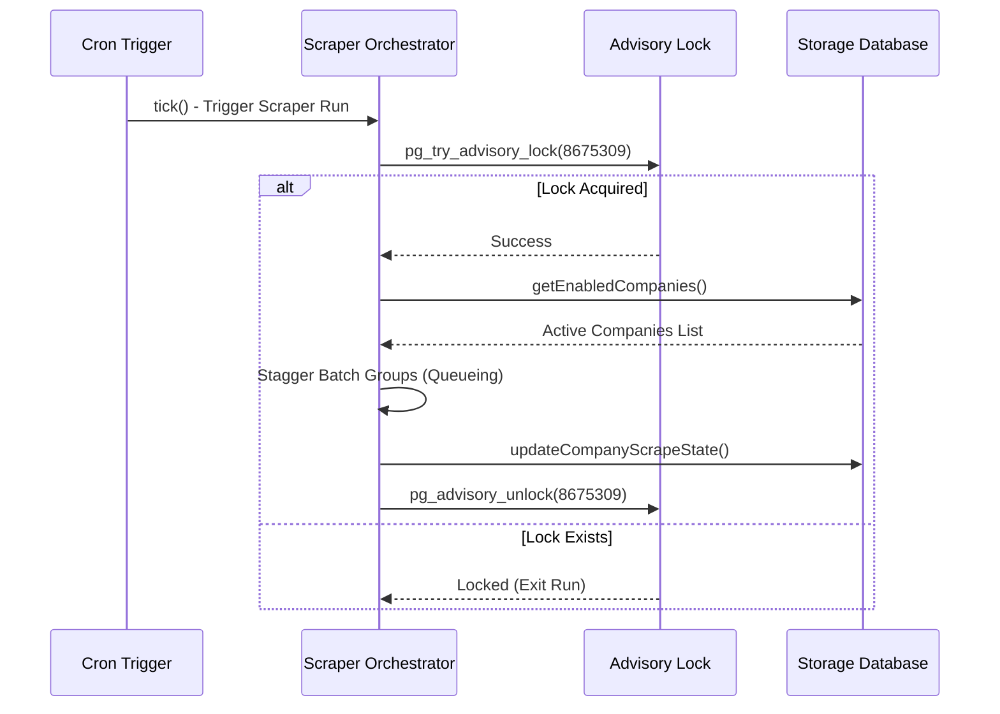
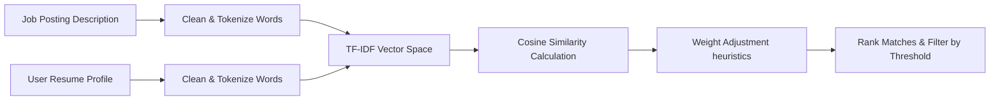
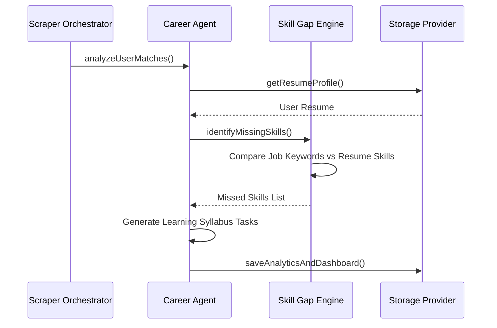
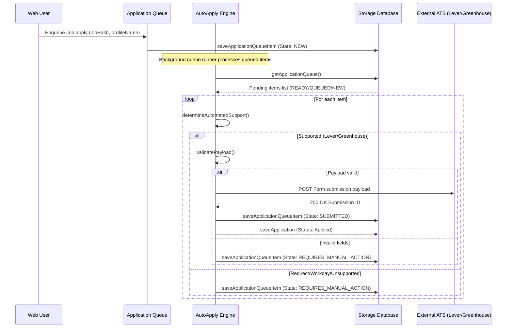
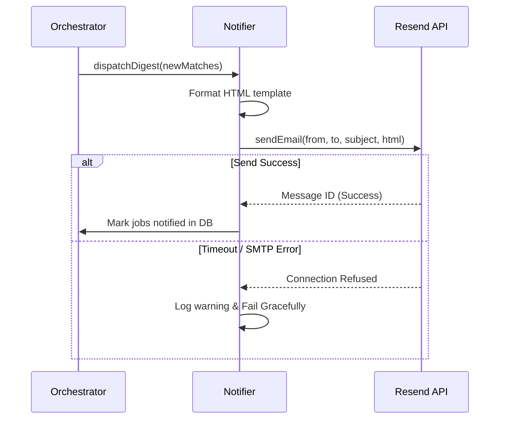
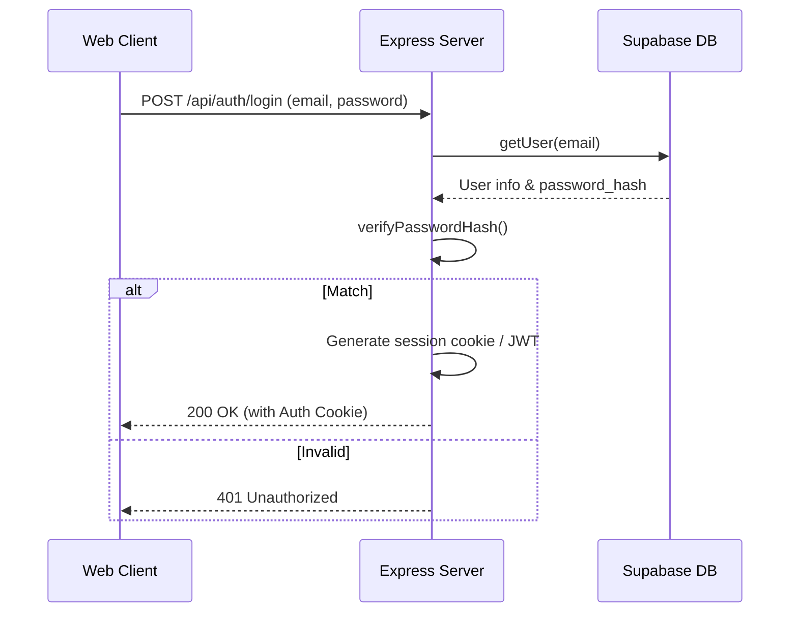

# Architecture Guide

## Metadata
- **Title**: Architecture Guide - Job Monitor Platform
- **Purpose**: Details the high-level and module-level architecture, database ERD, data flow systems, and infrastructure design.
- **Last Updated**: 2026-07-13
- **Current Version**: v5.0.0
- **Cross-References**: [PRD.md](file:///c:/Users/varun/Downloads/Job%20Monitor/docs/PRD.md), [DATABASE.md](file:///c:/Users/varun/Downloads/Job%20Monitor/docs/DATABASE.md), [TECH_STACK.md](file:///c:/Users/varun/Downloads/Job%20Monitor/docs/TECH_STACK.md)

---

## Table of Contents
1. [High-Level Architecture](#high-level-architecture)
2. [Frontend Architecture](#frontend-architecture)
3. [Backend Architecture](#backend-architecture)
4. [Database & Storage Providers](#database--storage-providers)
5. [Core Pipelines](#core-pipelines)
   - [Scraper & Job Monitor Pipeline](#scraper--job-monitor-pipeline)
   - [Scheduler & Locking Pipeline](#scheduler--locking-pipeline)
   - [Resume Matching Pipeline](#resume-matching-pipeline)
   - [AI Copilot & Career Agent Pipeline](#ai-copilot--career-agent-pipeline)
   - [Auto-Apply Workflow](#auto-apply-workflow)
   - [Notification Flow](#notification-flow)
6. [Authentication Flow](#authentication-flow)
7. [State Management](#state-management)
8. [Build & Deployment Pipelines](#build--deployment-pipelines)

---

## High-Level Architecture

The Job Monitor Platform is designed as a decoupled client-server architecture with support for both local development (FileStorage mode) and production scale (Supabase Cloud mode).



---

## Frontend Architecture

The frontend is a single-page application (SPA) built using modern web paradigms:
- **Framework**: **React 19**
- **Build Tool**: **Vite v8**
- **Styling**: **TailwindCSS v4** (utilizing native CSS configuration imports)
- **Routing**: **React Router v7** (configured with client-side SPA routing)
- **Data Fetching**: **TanStack React Query v5** (provides server-state caching, synchronization, and automated mutations)
- **UI Design System**: Curated dark theme, glassmorphic layout, using Lucide-react for iconography and Recharts for analytics data visualization.

### Folder Division
All frontend features are modularly structured under `frontend/src/features/` with isolated components, state actions, and view pages:
- `/dashboard`: High-level summaries, statistics widgets, funnel status charts.
- `/tracker`: Kanban application tracking board.
- `/explorer`: Scraped job board browser with AI contact recommendation widgets.
- `/copilot`: Chat assistants, mock interview simulators, and study syllabi.
- `/referrals`: CRM pipeline, CSV contact importer, and template generators.
- `/automation`: Automation queues, run status displays, and rules setup.

---

## Backend Architecture

The backend is built as a robust **Node.js TypeScript API server** using **Express v5**:
- **Framework**: **Express 5.2** (featuring asynchronous middleware handler insulation)
- **Bootstrap**: Coordinates server startups, scheduler crons, database adapter bindings, and error-insulated email queues.
- **Client Handling**: Integrated with Helmet headers (CSP, frame protections), CORS origin filters, and input sanitization guards to protect against XSS/injections.
- **Scraper Engines**: Built with a hierarchy using Playwright (browser crawling for dynamic sites) and Cheerio (high-speed static HTML extraction).
- **Outreach Integration**: Formulates custom outreach messages, compiles EML file objects, and integrates with Gmail compose targets.

---

## Database & Storage Providers

The system implements a unified **StorageProvider** interface:
- **Local Mode (FileStorage)**: Automatically selected if no Supabase environment secrets are detected. Writes tables as JSON files into `storage/*.json` (e.g. `jobs.json`, `applications.json`, `referrals.json`).
- **Cloud Mode (SupabaseStorage)**: Connects to a remote Supabase PostgreSQL database. Enforces Row Level Security (RLS) policies at the database layer to ensure strict data isolation.

### Database ERD

```mermaid
erDiagram
    job_monitor_companies ||--o{ job_monitor_state : "has"
    job_monitor_companies ||--o{ job_monitor_jobs : "scrapes"
    auth_users ||--o{ job_monitor_profiles : "has_profile"
    auth_users ||--o{ job_monitor_resume_profiles : "owns_resumes"
    auth_users ||--o{ job_monitor_applications : "tracks_applications"
    auth_users ||--o{ job_monitor_saved_searches : "saves_searches"
    auth_users ||--o{ job_monitor_watchlists : "saves_watchlists"
    auth_users ||--o{ job_monitor_user_notifications : "receives_notifications"
    auth_users ||--o{ job_monitor_copilot_recommendations : "gets_recommendations"
    auth_users ||--o{ job_monitor_learning_roadmaps : "has_roadmaps"
    auth_users ||--o{ job_monitor_interview_sessions : "has_sessions"
    auth_users ||--o{ job_monitor_career_roadmaps : "has_career_roadmaps"
    auth_users ||--o{ job_monitor_daily_briefs : "has_briefs"
    auth_users ||--o{ job_monitor_application_queue : "queues_auto_apply"
    auth_users ||--o{ job_monitor_recruiters : "manages_recruiters"
    auth_users ||--o{ job_monitor_calendar_events : "tracks_events"
    auth_users ||--o{ job_monitor_exports : "owns_exports"
    auth_users ||--o{ job_monitor_referrals : "tracks_referrals"
    auth_users ||--o{ job_monitor_audit_logs : "records_logs"
```


---

## Core Pipelines

### Scraper & Job Monitor Pipeline
When scraping a company, the orchestrator detects the Applicant Tracking System (ATS), selects the proper plugin, executes the scrape, normalizes the job description, matches it, and saves it.



### Scheduler & Locking Pipeline
The scheduler triggers scraper runs at configurable intervals. To prevent race conditions between replica node servers in production cloud mode, a distributed advisory lock is acquired on Supabase before running.



### Resume Matching Pipeline
Calculates real-time candidate fit scores using NLP comparison metrics:



Heuristics evaluation weights are normalized to sum to 100%:
- **Skills Overlay**: 40% (direct matches of technical keywords)
- **Job Title Alignment**: 30% (role hierarchy and keywords similarity)
- **Experience Match**: 15% (compares candidate years vs job requirements)
- **Location Alignment**: 10% (remote/hybrid preferences)
- **TF-IDF Vector Score**: 5% (overall textual semantic similarity)

### AI Copilot & Career Agent Pipeline
Analyzes user skill gaps and generates custom study syllabus tasks:



### Auto-Apply Workflow
Queues and processes job application submissions automatically:



### Notification Flow
Insulates email dispatch to prevent SMTP issues from halting core runtimes:



---

## Authentication Flow

Coordinates secure session establishment:



*Note: In local mode, authMiddleware checks token strings for mock roles (e.g. Admin, User, Viewer).*

---

## State Management

- **Client state**: Managed using React context and hook forms.
- **Server state**: Handled using **TanStack React Query** mutations and query caches, eliminating redundant state flags and ensuring UI views immediately refresh upon database changes.
- **Background workers state**: Maintained in database queue tables (`job_monitor_application_queue`, `job_monitor_state`) and read periodically by backend cron threads.

---

## Build & Deployment Pipelines

### Local Build & Development
Run the orchestrator, server, and client concurrently:
```bash
# Run server watch compile and Vite client dev server
npm run dev:start
```

### Compile & Build Checks
TypeScript is checked across both backend and frontend layers:
- Backend: `tsc` compiles files into `dist/*`.
- Frontend: `tsc -b && vite build` generates optimized assets under `frontend/dist/`.

### Docker Architecture
The container setup wraps the compiled Express API server alongside Playwright headless dependencies, enabling deployment to cloud platforms like Render, AWS, or Azure:
```bash
# Compile and package Docker container
docker build -t job-monitor:latest .
```
See [DEPLOYMENT.md](file:///c:/Users/varun/Downloads/Job%20Monitor/docs/archive/DEPLOYMENT.md) for detailed instructions.
