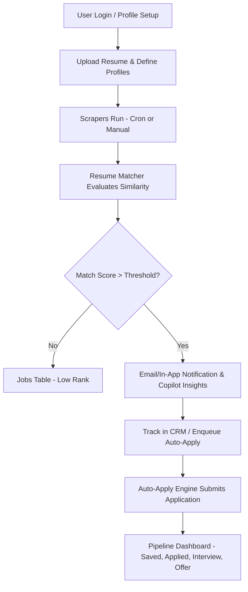

# Product Requirements Document (PRD)

## Metadata
- **Title**: Product Requirements Document (PRD) - Job Monitor Platform
- **Purpose**: Defines the product vision, core features, requirements, user personas, and success metrics for the Job Monitor Platform.
- **Last Updated**: 2026-07-13
- **Current Version**: v5.0.0
- **Cross-References**: [ARCHITECTURE.md](file:///c:/Users/varun/Downloads/Job%20Monitor/docs/ARCHITECTURE.md), [FEATURES.md](file:///c:/Users/varun/Downloads/Job%20Monitor/docs/FEATURES.md), [TECH_STACK.md](file:///c:/Users/varun/Downloads/Job%20Monitor/docs/TECH_STACK.md)

---

## Table of Contents
1. [Project Overview](#project-overview)
2. [Problem Statement](#problem-statement)
3. [Vision & Scope](#vision--scope)
4. [Target Users & Personas](#target-users--personas)
5. [User Journey & Flow](#user-journey--flow)
6. [Functional Requirements](#functional-requirements)
7. [Non-Functional Requirements](#non-functional-requirements)
8. [Current vs Planned Features](#current-vs-planned-features)
9. [Future Roadmap](#future-roadmap)
10. [Success Metrics](#success-metrics)
11. [Known Limitations](#known-limitations)

---

## Project Overview

The **Job Monitor Platform** is an enterprise-grade, autonomous job search coordinator and career copilot. It automates the candidate funnel by continuously scanning company career portals (ATS boards like Greenhouse, Lever, and Workday), normalizing crawled job postings, computing algorithmic fit scores using natural language processing (NLP), detecting skill gaps, generating customized study syllabus tracks, tracking outreach touchpoints via a built-in CRM, and managing automated applications in a queue.

---

## Problem Statement

Modern job hunting is fragmented, highly manual, and inefficient. Candidates face several key paint points:
1. **Inefficient Sourcing**: Checking dozens of individual company career portals daily for newly posted roles.
2. **Information Asymmetry**: Applying to roles without knowing how well their resume aligns with the job description keywords.
3. **Manual Overhead**: Re-entering the same profile details, downloading and adjusting resume versions, and manually tracking application funnels in spreadsheets.
4. **CRM and Outreach Disorganization**: Losing track of recruiter conversations, connection requests, and scheduled mock interviews.

---

## Vision & Scope

The Job Monitor Platform bridges this gap by acting as a personal **Autonomous Career Agent**. Instead of checking job boards, the system actively crawls them. Instead of guess-work, it provides a quantitative **Opportunity Score** (0-100) based on title, skills overlap, location preferences, and TF-IDF similarity. It integrates intelligent CRM tools to schedule follow-ups and generate personalized outreach messages, and implements an **Auto-Apply Engine** to submit candidate profiles directly to supported Applicant Tracking Systems (ATS).

---

## Target Users & Personas

### Target Users
- **Active Job Hunters**: Candidates seeking high-efficiency sourcing and automated status tracking.
- **Career Switchers**: Professionals seeking to close skill gaps by identifying exactly what technologies they lack for target job listings.
- **Enterprise Admins**: Power users coordinating application campaigns across multiple profiles.

### User Personas

#### Persona A: Varun (The Active Backend Engineer)
- **Background**: Software Engineer with 3 years of experience.
- **Goals**: Switch to a senior backend role using TypeScript, Docker, and AWS. Wants to apply only to highly matching remote/hybrid positions.
- **Pain Points**: Spends 2 hours every evening browsing Greenhouse/Lever job boards, resulting in application fatigue.

#### Persona B: Priya (The Career Transitioner)
- **Background**: QA Engineer transitioning into a Full-Stack developer.
- **Goals**: Understand what backend technologies she needs to learn to qualify for modern full-stack developer roles.
- **Pain Points**: Unsure of which frameworks (e.g. Express, NestJS) are most in-demand for her target companies.

---

## User Journey & Flow

---

## Functional Requirements

### 1. Multi-ATS Crawling & Normalization
- The system must identify Greenhouse, Lever, and Workday portals.
- It must normalize job listings into unified schemas: Title, Company, Description, Location, Remote/Hybrid status, Employment Type, and Date Posted.
- Staggered queue workers must scrape portals in parallel batches while respecting rate limits.

### 2. Resume Matching & Scoring Engine
- Must tokenize job descriptions and resumes, computing TF-IDF similarity.
- Final scores must adjust based on heuristics: Job Title matching (30%), Skills overlap (40%), Experience level matching (15%), Location matching (10%), and TF-IDF similarity (5%).
- Customizable weights and minimum threshold filters (e.g. default 70%).

### 3. AI Career Copilot & Analytics
- Extract missing skills, explain match reasons, and suggest resume improvements.
- Generate step-by-step syllabus study guides for missing skills.
- Conduct interactive Mock Interviews, recording user responses and outputting feedback.
- Produce Market Intelligence on company salary ranges and tech stack trends.

### 4. Application Tracking (CRM) & Automation
- Kanban board mapping stages: Saved, Applied, OA Scheduled, OA Completed, Interview, Offer, Rejected, Closed.
- Recruiters CRM tracker supporting contact details, conversation logs, and follow-up alert logs.
- Auto-Apply Engine to execute form submissions on Greenhouse and Lever boards using Playwright browser actions.
- CSV import for LinkedIn connections with automatic relationship type mapping.

---

## Non-Functional Requirements

### 1. Resiliency & Reliability
- **PostgreSQL Advisory Locking**: Distributed session-level lock (`8675309`) preventing execution races between duplicate scraping coordinators in cloud mode.
- **Circuit Breakers**: Automatically suspend scrapers that encounter consecutive failures, avoiding API blocks or IP bans.
- **Error Isolation**: Email notifications must run inside insulated try/catch blocks to prevent email provider failures from crashing orchestrator tasks.

### 2. Performance & Scale
- Orchestrator batches must stagger crawl tasks to throttle requests.
- Local mode (JSON FileStorage) and cloud mode (Supabase PostgreSQL) adapters.
- Build compile safety verified by sequential and concurrent load/stress Jest test suites.

### 3. Security & Compliance
- **Helmet Headers**: Secure CSP mapping, X-Frame-Options (`SAMEORIGIN`), and MIME sniffing protection.
- **Input Sanitization**: Clean all strings in `req.body`, `req.query`, and `req.params` against script/tag injections.
- **LinkedIn Compliance**: The system must assist the user (e.g. prefill outreach templates, format EML, rank contacts) but **NEVER** automate actions directly on LinkedIn's web page, keeping users safe from ToS violations.

---

## Current vs Planned Features

| Feature Component | Current Implementation (v5.0.0) | Planned / Future Scope |
| :--- | :--- | :--- |
| **Scraping** | Greenhouse, Lever, Workday plugins + Playwright/Cheerio fallback. | LinkedIn, Indeed, and ZipRecruiter API crawlers. |
| **Matching** | Cosine similarity & weighted heuristics profiles. | Vector DB semantic embedding search (e.g. pgvector). |
| **Copilot** | Skill Gap analysis, Mock Interview simulation. | Real-time audio-based interview copilot. |
| **Outreach** | LinkedIn CSV Connections import, Gmail compose URL, EML download. | Direct LinkedIn API connection, automated inbox CRM. |
| **Automation** | Auto-Apply form submitter for Greenhouse and Lever. | Workday automated browser workflows; Captcha-solving integrations. |

---

## Future Roadmap
- **pgvector Integration**: Upgrade search capabilities by storing resume and job posting embeddings in a PostgreSQL vector extension.
- **Multi-Tenant SaaS**: Complete support for isolated multi-user organizations with tiered RBAC permissions (Admin, User, Viewer).
- **Mobile Client**: iOS/Android companion app using React Native for instant notification push alerts.

---

## Success Metrics
- **Crawl Efficiency**: Under 10 seconds average scrape duration per company career portal.
- **Orchestrator Uptime**: 99.9% runtime reliability with circuit breaker protection.
- **Conversion Rate**: 90% reduction in manual job hunting overhead time.
- **Match Accuracy**: Algorithmic score correlation within 10% of manual recruiter assessments.

---

## Known Limitations
1. **Dynamic Pages (Workday)**: Highly nested React/Angular layout changes on Workday boards occasionally require selector adjustments.
2. **Third-Party Rate Limits**: High-frequency scrapes without proxies can trigger IP rate-limiting. Staggered queues must be strictly calibrated.
3. **LinkedIn Automation Boundaries**: No direct automated messaging or connection-sending on the LinkedIn site to maintain compliance.
